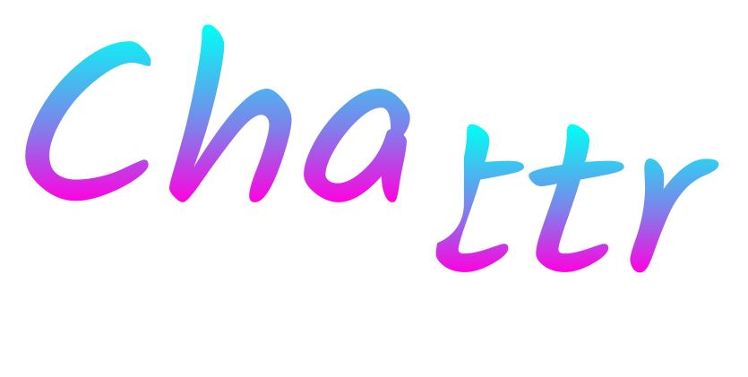

# Chattr

*A chat app made using Go and React.js*

*Built using this [tutorial](https://tutorialedge.net/projects/chat-system-in-go-and-react/) with some modifications due to how outdated it is.

## How to Use it:
- Go to the [deployment](https://go-and-react-website.vercel.app/)
- Type your message and hit `ENTER`
- Wait for someone else to message back!

## What's Happening:
- You send your message through the frontend
- This message gets sent to the backend through a websocket connection
- The backend then sends a pool of all messages back through the websocket
- Finally, the frontend displays all the messages that were sent while your instance of the frontend was running

## How to Run it Locally:
- Open 2 terminals/powershells
- In one, run `cd .\backend\`
- Then run `go mod tidy`
- Finally run `go run .`
- Then for the other terminal, run `cd .\frontend\`
- Then run `npm install`
- Finally run `npm run start`

## License:
This project is licensed under the BSD 3-Clause "New" or "Revised" License and can be found [here](LICENSE)
